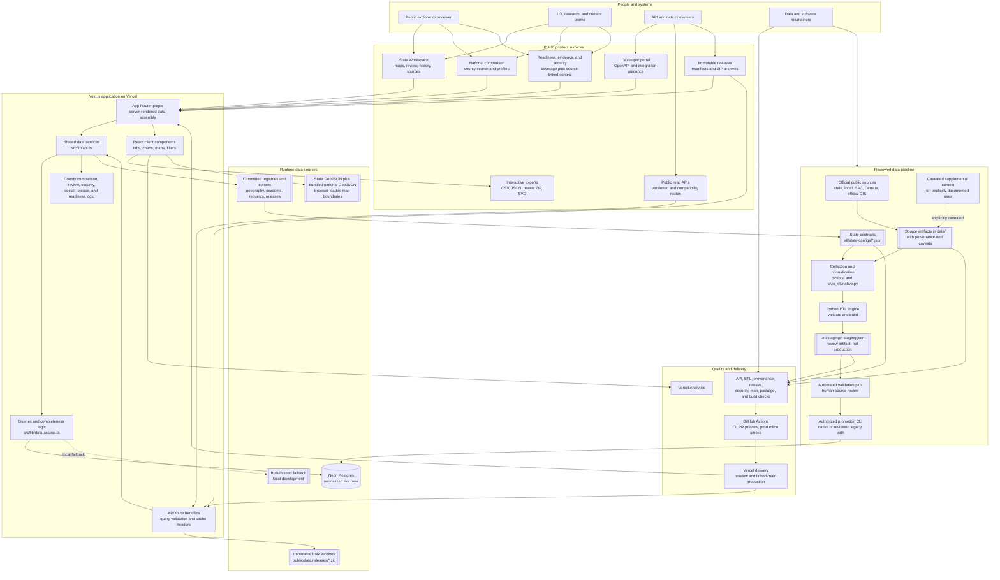
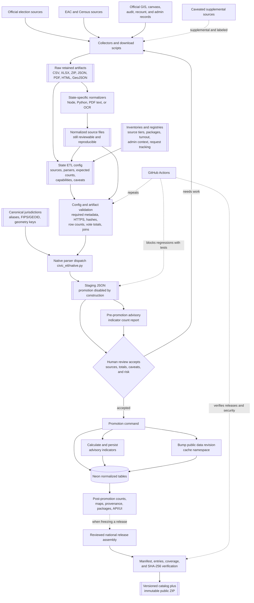
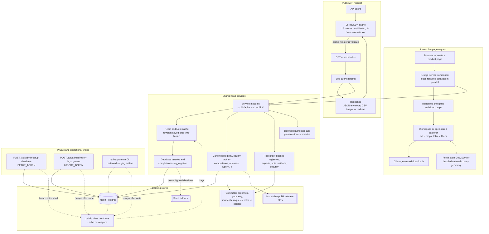
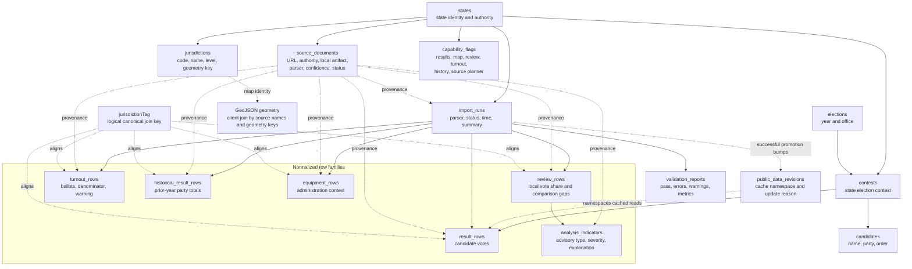
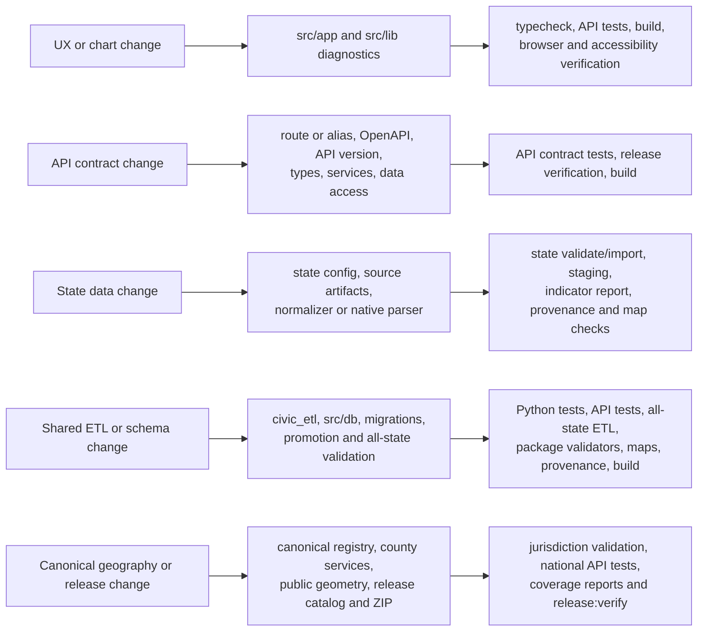

---
aliases:
  - Civic Result Maps Topology
  - CivicResultMaps Architecture
tags:
  - civic-result-maps
  - architecture
  - topology
  - mermaid
updated: 2026-07-14
---

# Civic Result Maps system topology

This is the shared map of Civic Result Maps for product, UX, engineering, data,
and API work. Read the first diagram from top to bottom. The later diagrams zoom
into the product surface, data lifecycle, runtime, and normalized data model.

In one sentence: the project retains cited public records, turns them into
reviewed normalized data, and serves that data through maps, review tools,
exports, and a read-only API without hiding its provenance or limitations.

This is a subsystem-level topology. The many state-specific configs, collectors,
normalizers, parsers, and tests are shown as repeated component families so the
map remains readable.

> [!tip] Obsidian
> Open this note in Reading view; each Mermaid block is a separate level of detail.

> [!important] Interpretation boundary
> Civic Result Maps publishes source-linked results, coverage limits, and
> advisory review signals. An indicator or data gap is a prompt for source
> reconciliation and human review, not a finding of fraud, tampering,
> misconduct, or intent.

## 1. The whole platform at a glance

The key distinction is between two paths:

- The **read path** runs from the browser or API through Next.js into Neon or a
  repository-backed registry.
- The **write path** runs from cited source artifacts through reproducible ETL,
  staging, validation, human review, and an explicit promotion command.

## 2. Product and UX topology

```mermaid
flowchart TB
  Shell["State Workspace<br/>/?state=XX&tab=..."]
  Shell --> Header["Top bar, state switcher,<br/>national overview, metrics"]
  Shell --> Tour["Guided tour and ELI5 help"]
  Shell --> Notes["Persistent Data Notes<br/>readiness, caveats, next actions"]

  Shell --> Explore
  Shell --> Understand
  Shell --> Share

  subgraph Explore["Explore and review"]
    Map["Map"]
    Review["Review Center"]
    History["History"]
    Electronic["Electronic Integrity"]

    Map --> MapModes["Winner | Margin | Votes<br/>Method | Equipment | Security"]
    Map --> Drawer["Jurisdiction drawer<br/>results, indicators, source receipt"]
    Review --> ReviewViews["Overview | Evidence Tools<br/>Screening | Indicators"]
    Review --> ReviewCharts["Readiness, flag mix, scatter,<br/>drop-off, ticket-splitting proxy"]
    History --> HistoryCharts["Share, margin, movement,<br/>Klimek proxy and Shpilkin histograms"]
    Electronic --> Requests["Evidence inventory and<br/>user-sent records-request drafts"]
  end

  subgraph Understand["Understand provenance and readiness"]
    Planner["Source Planner"]
    Data["Data and Sources"]
    Guide["Review Guide"]
    Imports["Import Runs"]
    Planner --> Capability["Capability checklist and missing work"]
    Data --> Bibliography["Authorities, URLs, artifacts,<br/>parsers, confidence, caveats"]
    Guide --> Method["Responsible review rules,<br/>workflows, glossary, formulas"]
    Imports --> Lineage["Parser, status, time, summary"]
  end

  subgraph Share["Share and participate"]
    ExportTab["Exports & API"]
    Support["Support"]
    Contact["Contact"]
    ExportTab --> Files["CSV, JSON, SVG,<br/>review-packet ZIP"]
    ExportTab --> Links["Copyable public API URLs"]
  end
  Followup["External follow-up<br/>GitHub issues and user-sent email or portal requests"]
  Drawer -. report a data issue .-> Followup
  Requests --> Followup

  OtherPages["Other first-class pages"]
  OtherPages --> ComparePage["/compare<br/>national county swing and flip explorer"]
  ComparePage --> CountyPage["/county/{fips}<br/>permanent county profile"]
  OtherPages --> ReadinessPage["/readiness<br/>national status and state package details"]
  OtherPages --> EvidencePage["/evidence<br/>records timeline; /timeline redirects here"]
  OtherPages --> SecurityPage["/security<br/>source-linked incident explorer"]
  OtherPages --> DeveloperPage["/developers<br/>v1 API documentation"]
  DeveloperPage --> ReleasePage["/releases<br/>versioned manifests and bulk downloads"]
  OtherPages --> SocialCard["/api/social-card<br/>state-aware share image"]
```

The workspace always carries the same safety context into the detailed views:
source provenance, readiness badges, chart gates, warnings, and Data Notes are
part of the experience rather than optional documentation.

### Best starting point by audience

| Audience | Start here | Then use |
| --- | --- | --- |
| General visitor | State Workspace -> Map | Data Notes, source drawer, Review Guide |
| UX or product designer | Guided tour -> all workspace tabs | `/readiness`, `/compare`, and county profiles for cross-state and empty states |
| Human reviewer | Data & Sources -> Review Center | History, Evidence, Security, Electronic Integrity, review-packet export |
| API consumer | `/developers` -> `/api/v1/jurisdictions` | County profiles, comparisons, confidence definitions, OpenAPI, and releases |
| Data engineer | State config -> ETL import -> staging | validators, indicator report, reviewed promotion |
| Maintainer | CI workflow and tests | Vercel preview, production validators, API/UI verification |

## 3. Data lifecycle and trust gates

Important gates:

1. A state config cannot request or authorize a production write.
2. Staging artifacts explicitly say that human review is required and
   production writing is not allowed.
3. Promotion is a separate, intentional command with a configured database URL.
4. Result, review, turnout, historical, equipment, source, capability,
   validation, import-run, and indicator records retain lineage.
5. Versioned national releases are separate committed snapshots whose manifest,
   archive contents, coverage statement, and SHA-256 hashes are verified.
6. `jurisdictionTag` is the canonical cross-year/cross-source join key. Ambiguous,
   non-geographic, statewide-only, or otherwise unreviewed units are not forced
   into county FIPS tags.

## 4. Runtime and API request topology

### Public endpoint families

All public endpoints are read-only. JSON data endpoints return `{ data, meta }`;
`meta` includes `generatedAt`, `source`, `schemaVersion`, and `releaseId`, with
pagination metadata on collections. CSV routes return download headers, release
downloads redirect to immutable archives, and the social-card route returns an
image.

| Family | Endpoints | Primary backing |
| --- | --- | --- |
| Stable county API (preferred) | `/api/v1/flips`, `/api/v1/counties/{fips}`, `/api/v1/jurisdictions`, `/api/v1/jurisdictions/search`, `/api/v1/confidence`, `/api/v1/releases`, `/api/v1/releases/{releaseId}`, `/api/v1/releases/{releaseId}/download`, `/api/v1/openapi` | Neon plus the canonical registry, release catalog, and immutable archive |
| Compatibility aliases | `/api/flips`, `/api/counties/{fips}`, `/api/jurisdictions`, `/api/jurisdictions/search`, `/api/confidence`, `/api/releases`, `/api/releases/{releaseId}`, `/api/releases/{releaseId}/download`, `/api/openapi` | The same handlers as v1 |
| State results and lineage | `/api/states`, `/api/elections`, `/api/results`, `/api/sources`, `/api/coverage`, `/api/completeness`, `/api/import-runs` | Neon and derived completeness logic, with local seed fallback |
| Review | `/api/indicators`, `/api/review-rows` | Neon normalized review and indicator rows |
| Context and administration | `/api/turnout`, `/api/historical-baselines`, `/api/equipment`, `/api/vote-methods`, `/api/security-incidents` | Neon rows plus normalized or versioned repository artifacts |
| Planning registries | `/api/native-source-packages`, `/api/source-acquisition-tiers`, `/api/turnout-sources`, `/api/admin-sources` | Versioned JSON registries in `data/` |
| Evidence workflows | `/api/electronic-integrity`, `/api/electronic-integrity-requests`, `/api/source-records-requests` | Versioned artifact, contact, tracker, and operation registries |
| Cross-state status | `/api/swing-state-parity` | Versioned parity registry |
| Sharing | `/api/social-card` | Result, completeness, comparison, or security services used by social metadata |

New integrations should prefer `/api/v1`; the unversioned county platform routes
are compatibility aliases, while state-focused routes remain unversioned. For
large review or historical extracts, use `includeMetrics=true` only when the
calculation metadata is required and respect row limits. For bulk county use,
prefer pagination, compact JSON, CSV, or an immutable release ZIP.

## 5. Normalized data model

`jurisdictionTag` is intentionally a logical canonical key across row families,
not a substitute for each source's original display name or reporting unit.
Source display names remain visible so reconciliation stays reviewable. The
current map clients separately resolve committed GeoJSON properties to result
display names and report missing or unmapped joins.

National county comparisons and county profiles are derived read models, not
separate database tables: they join normalized result, historical, turnout, and
source rows to the canonical county registry. Vote-method, security-incident,
request-tracker, release-catalog, and immutable archive data remain
repository-backed.

## 6. Repository component map

| Component | Responsibility | Main path |
| --- | --- | --- |
| Product pages | State workspace, national comparison, county profiles, readiness, evidence, security, releases, developer docs, social metadata | `src/app/` |
| Public and admin routes | Versioned and compatibility read APIs, cached envelopes, token-protected setup/legacy operations | `src/app/api/` |
| Client experience | Tabs, guided tour, state and national maps, charts, search, exports, Data Notes | `src/app/workspace-tabs.tsx`, `src/app/results-explorer.tsx`, `src/app/compare/` |
| Shared read layer | Revision-keyed caching, database/seed reads, completeness | `src/lib/api.ts`, `src/lib/data-access.ts`, `src/db/public-data-revision.ts` |
| Domain logic | Canonical geography, county comparison/profile, review policy, security, releases, diagnostics, registry readers | `src/lib/` |
| Database model and importers | Drizzle schema, native and legacy promotion, starter seed | `src/db/` |
| Migrations | Postgres schema history | `drizzle/` |
| ETL contracts | Per-state sources, parser choices, expected totals, capabilities | `etl/state-configs/` |
| ETL engine | Config loading, validation, native parser dispatch, staging | `civic_etl/` |
| Data operations | Collect, normalize, reconcile, report, validate, promote | `scripts/` |
| Source and context artifacts | Official files, normalized files, geometry, inventories, registries, release catalog | `data/` |
| Immutable public data products | National county geometry and versioned release ZIPs | `public/data/` |
| Generated pre-production artifacts | Reviewable state staging output | `.etl/staging/` |
| Tests | API/contracts and Python ETL/state coverage | `tests/api/`, `tests/python/` |
| Request boundary | Production HTTP-to-HTTPS redirect | `src/proxy.ts` |
| Runtime and task configuration | Next.js, Vercel, Drizzle, and npm command graph | `next.config.ts`, `vercel.json`, `drizzle.config.ts`, `package.json` |
| Delivery | CI validation, Vercel preview deployment, and production security smoke | `.github/workflows/ci.yml`, `.github/workflows/security-production-smoke.yml`, `vercel.json` |
| Static brand assets | Favicons, logos, UI icons, and public data assets | `public/` |
| Operating documentation | Developer playbook, source packages, turnout, calculations | `docs/` |

## 7. Source-of-truth guide

| Question | Source of truth |
| --- | --- |
| What live result, review, turnout, history, and equipment rows are served? | Neon Postgres through `src/lib/data-access.ts` |
| What happens locally without a database URL? | Built-in seed data supplies the basic read experience |
| Where did a result or context row come from? | `source_documents`, the matching state config, and the retained `data/` artifact |
| Is a state ready for a particular feature? | Live capability/completeness rows combined with versioned source-package registries |
| Which geography joins across 2024, 2020, 2016, and other row families? | Reviewed `jurisdictionTag` values from `data/canonical-jurisdictions.json` |
| What contract should a new API integration use? | `/api/v1`, documented by `src/lib/openapi.ts` and versioned in `src/lib/api-version.ts` |
| Where does map geometry come from at runtime? | State maps fetch committed GeoJSON from raw GitHub `main/data`; national maps use `public/data/national-counties.geojson` |
| Is a staging file live? | No. `.etl/staging` is a pre-production review boundary |
| Is a release ZIP the same as the live API? | No. `data/national-data-releases.json` describes immutable, hashed snapshots in `public/data/releases/`; live API responses can evolve within their contract |
| What invalidates cached live reads after promotion? | A transactional bump to the `public_data_revisions` cache namespace |
| Who can write production data? | Explicit token-protected admin operations or an authorized promotion command; public APIs are read-only |
| What does an advisory indicator prove? | Nothing by itself; it prioritizes source reconciliation and human review |

## 8. Change-impact shortcuts

## Primary implementation references

- [README](../README.md)
- [Developer playbook](developer/index.md)

- [Native import source packages](native-import-source-packages.md)
- [Turnout collection inventory](turnout-collection-inventory.md)
- [Application data assembly](../src/app/page.tsx)
- [Workspace experience](../src/app/workspace-tabs.tsx)
- [Map and result explorer](../src/app/results-explorer.tsx)
- [Shared API layer](../src/lib/api.ts)
- [Public API contract](../src/lib/openapi.ts)
- [Data access](../src/lib/data-access.ts)
- [National county services](../src/lib/national-county-comparison-data.ts)
- [Database schema](../src/db/schema.ts)
- [Release catalog](../data/national-data-releases.json)
- [Security incident registry](../data/election-security-incidents-2024.json)
- [Native promotion](../src/db/native-import.ts)
- [ETL pipeline](../civic_etl/pipeline.py)
- [CI workflow](../.github/workflows/ci.yml)
