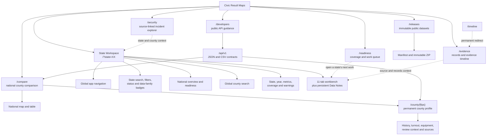
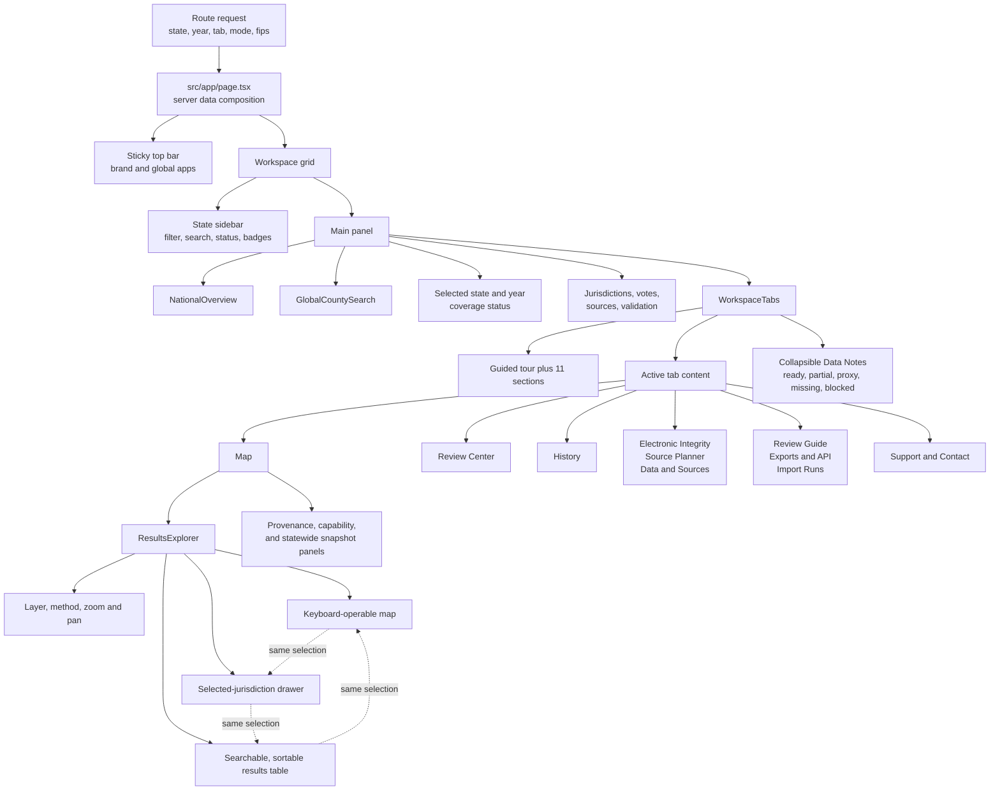
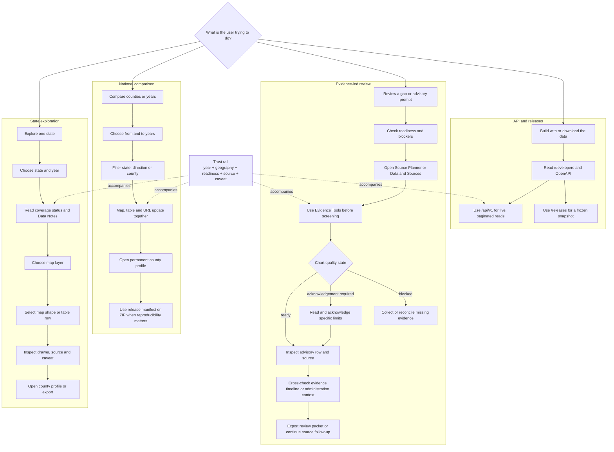
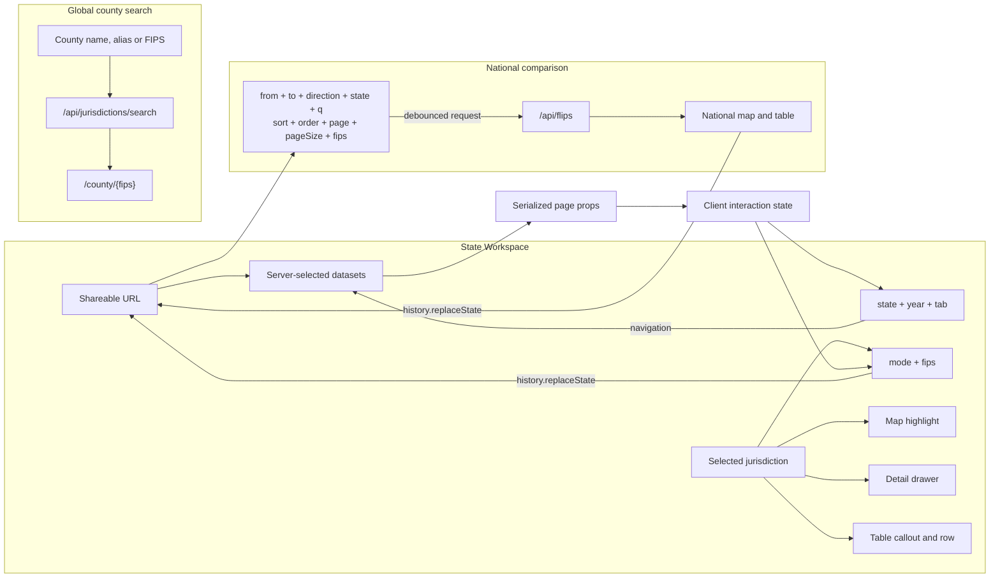
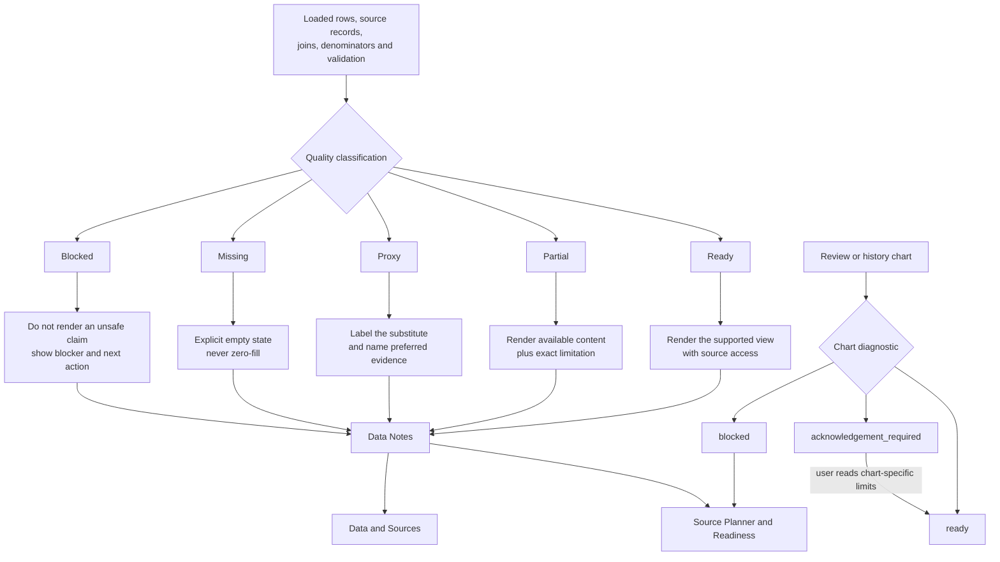
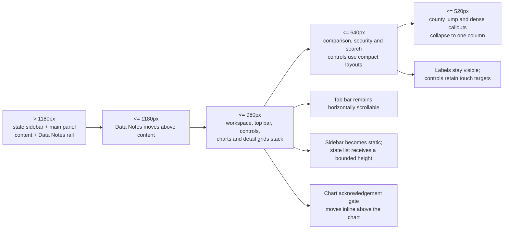
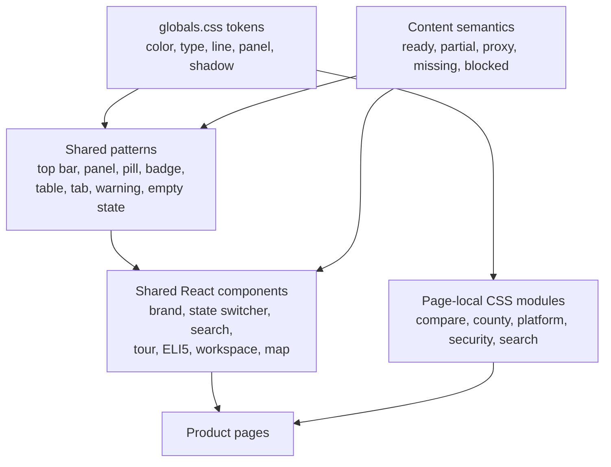

---
aliases:
  - Civic Result Maps UI UX README
  - Civic Result Maps UX topology
  - UI UX architecture
tags:
  - civic-result-maps
  - ui
  - ux
  - information-architecture
  - accessibility
  - topology
  - mermaid
updated: 2026-07-14
---

# Civic Result Maps UI/UX README

This is the product-facing companion to the [system topology](../system-topology.md).
It describes the implemented information architecture, interaction model, trust
states, responsive behavior, accessibility contract, and component ownership for
Civic Result Maps.

Use it when designing a feature, reviewing a flow, changing a React component,
writing interface copy, or integrating the public API with a user-facing product.
The diagrams are layered so a product designer can start with journeys, a UX
developer can follow state and component ownership, and an engineer can find the
runtime boundary behind each surface.

> [!tip] Obsidian
> Open this note in Reading view. Each Mermaid block is an independent zoom level.

> [!important] Interpretation boundary
> Results, readiness states, source gaps, and advisory indicators must remain
> visibly distinct. An advisory indicator or missing record is a prompt for
> source reconciliation and human review, not evidence of fraud, tampering,
> misconduct, intent, or an incorrect outcome.

## 1. Experience contract

| Principle | Required interface behavior |
| --- | --- |
| Context before interpretation | Put year, geography, coverage, source status, and caveats before or beside maps and charts. |
| Missingness stays visible | Never turn missing, blocked, non-comparable, or statewide-only data into a zero or a fabricated county value. |
| Provenance is one action away | Keep source authority, URL, parser, confidence, and retained-artifact context reachable from the result or claim. |
| Progressive disclosure | Start with a legible overview, then reveal the jurisdiction, methodology, evidence, and lineage details needed for deeper review. |
| Shareable state | Important selections belong in stable routes or query parameters so a view can be copied, revisited, and tested. |
| One selection across views | Map, table, drawer, URL, and export state should identify the same jurisdiction and filters. |
| Neutral, actionable language | Explain what is loaded, what is limited, why it matters, and what evidence or action comes next. |
| Accessible by more than color | Pair every color or shape with text, status labels, accessible names, and keyboard-operable controls. |

## 2. Product information architecture

The State Workspace is the main exploratory workbench. The other pages are
first-class task surfaces, not modal variants of the workspace:

- Compare is optimized for cross-year, cross-state county comparisons.
- County profiles are permanent, FIPS-addressed detail pages.
- Readiness turns source and parser gaps into a reviewable work queue.
- Evidence and Security organize source-linked context without merging it into
  election-result claims.
- Releases and Developers support reproducible downloads and integrations.

## 3. State Workspace anatomy

### Workspace tabs

| Tab | User intent | Primary content | When data is limited |
| --- | --- | --- | --- |
| Map | Explore where results and context occur | Winner, margin, volume, vote-method, equipment, and security layers; table; jurisdiction drawer | Show an explicit geometry, join, statewide-only, or result-row message instead of a blank or invented map. |
| Review Center | Triage source-backed advisory prompts | Overview, Evidence Tools, Screening, Indicators, Methodology | Keep the evidence-readiness toolkit available and explain why charts are absent, gated, or partial. |
| History | Compare supported election years | Share, margin, movement, Klimek-style, and Shpilkin-style views | Label unavailable denominators and proxy methods; preserve non-comparable geography. |
| Electronic Integrity | Find retained administration evidence | Artifact inventory, request queue, and user-sent request drafts | Identify the missing record and responsible authority without implying misconduct. |
| Source Planner | Decide what to collect or fix next | Capability checklist, blockers, and source-package status | Make the next evidence or parser task explicit. |
| Data & Sources | Inspect the evidence behind the UI | Sources, results, review rows, turnout, vote methods, equipment, history | Show status and caveats for each family independently. |
| Review Guide | Understand safe interpretation | Responsible-review rules, glossary, workflows, and formulas | This remains useful even when no state data is loaded. |
| Exports & API | Reuse the current view | CSV, JSON, SVG, review-package ZIP, and API links | Export only what is actually loaded and include the same caveats and source manifest. |
| Import Runs | Audit how data arrived | Parser, status, timestamps, summaries, validation lineage | Distinguish no run from a failed or partial run. |
| Support | Find public evidence resources | EAC, NIST, certification, survey, and standards links | Keep links contextual and clearly external. |
| Contact | Report or continue work | Project contact and data-issue paths | Preserve the exact state, jurisdiction, source, chart, and date in the handoff. |

## 4. Core user journeys

## 5. Interaction and deep-link topology

### URL ownership

| Surface | State | Behavior |
| --- | --- | --- |
| State Workspace | `state` | Two-letter state selection. Choosing a state returns to that state's default workspace view. |
| State Workspace | `year` | `2016`, `2020`, or `2024`. Historical years apply to the Map tab; non-map tabs return to 2024 context. |
| State Workspace | `tab` | One of the 11 workspace tab keys. Tab selection is linkable and triggers navigation so the server loads only the required families. |
| State Workspace | `mode` | `winner`, `margin`, `volume`, `method`, `equipment`, or `security`. Updated in place by ResultsExplorer. |
| State Workspace | `fips` | Five-digit canonical county selection when the result row has a `county:<GEOID>` tag. Synchronizes map, drawer, table, and URL. |
| Compare | `from`, `to`, `direction`, `state`, `q` | Defines the comparison dataset and fetch request. Search is debounced. |
| Compare | `sort`, `order`, `page`, `pageSize`, `fips` | Defines presentation and selection state without changing the comparison contract. |
| County profile | `/county/{fips}` | Permanent route for one canonical county or county equivalent. |

When adding a new shareable control, decide explicitly whether it changes the
server dataset, the client presentation, or both. Preserve unknown-safe defaults,
back/forward behavior, and a useful first render without interaction.

## 6. Trust and data-state topology

### State semantics

| State | Meaning | Required UX |
| --- | --- | --- |
| Ready | Preferred evidence and required joins are available for this view. | Render normally, retain provenance, and avoid claiming more than the source supports. |
| Partial | Some rows, URLs, joins, fields, or jurisdictions are incomplete. | Keep usable content visible; state the exact missing scope and how it affects interpretation. |
| Proxy | A weaker but documented variable or source substitutes for the preferred evidence. | Use the word "Proxy," identify the substitute, and say what preferred evidence is absent. |
| Missing | No usable data is loaded for the requested family or scope. | Use an intentional empty state, not `0`, an empty chart, or an unqualified blank map. |
| Blocked | The view cannot responsibly make the requested comparison. | Suppress the claim or chart and present the blocker, responsible source, and next action. |
| Acknowledgement required | A chart has rows, but specific coverage or reconciliation limits need to be read first. | Keep the chart gated until the user acknowledges those chart-specific limitations. |

Quality describes evidence fitness and display readiness. It is not a credibility
rating for voters, candidates, jurisdictions, or election outcomes.

## 7. Responsive topology

The global stylesheet and page-local CSS modules use several content-driven
breakpoints rather than one universal device taxonomy:

| Scope | Breakpoints | Primary behavior |
| --- | --- | --- |
| Workspace and shared UI | 1180, 980, 520px; top-bar wrapping at 1120px | Collapse the sidebar/main and content/detail grids, move Data Notes, stack controls and warnings. |
| Compare and Security | 1240, 900, 640px | Reduce multi-column explorers, move controls and details into a linear reading order. |
| County profile | 1050, 700px | Collapse profile grids and dense context sections. |
| Developers and Releases | 820, 540px | Stack hero, endpoint, and release content. |
| Global county search | 620px | Stack search input, state scope, and result affordances. |

Design at the behavioral boundaries, not only at named device presets. Check long
state names, source titles, caveats, table columns, chart labels, and URL-driven
empty states at every boundary.

## 8. Visual system topology

### Foundation tokens

| Token or family | Current role |
| --- | --- |
| `--background`, `--panel`, `--panel-strong`, `--panel-hover` | Dark application canvas and progressive surface hierarchy. |
| `--foreground`, `--muted`, `--quiet` | Primary, secondary, and low-emphasis text. Essential caveats must not use the quietest treatment. |
| `--line` | Neutral structure for panels, tables, controls, and separators. |
| `--accent`, `--accent-soft`, `--accent-line` | Active controls, selected states, links, and ready status. |
| `--gold` | Partial, proxy, caution, and acknowledgement-required states. |
| `--red` | Missing or blocked state and explicitly labeled Republican/candidate encoding where applicable. Never rely on hue alone. |
| `--blue` | Explicitly labeled Democratic/candidate encoding and selected informational emphasis where applicable. Never rely on hue alone. |
| `--font-interface` | Geist/Inter/Segoe UI interface stack. |
| `--font-code` | Geist Mono/Cascadia/Consolas for IDs, counts, paths, and machine-facing values. |
| `--shadow` | High-level floating or elevated panels; do not use it to make every grouping card-like. |

Current shared styling is class-based in `globals.css`, while specialized pages
use CSS modules. There is no separate packaged design-system library. Reuse an
existing semantic pattern before adding a new one, and promote a repeated local
pattern into shared CSS only when its meaning is genuinely cross-product.

### Visual invariants

- The application is dark-first and declares `color-scheme: dark`.
- Accent green means selected, linked, live, or ready; it does not mean a
  political party.
- Gold means caution, partial, proxy, or acknowledgement required.
- Red and blue need explicit text labels when they encode political results.
- Panels use restrained borders and an 8px radius; pills are reserved for
  compact status or controls.
- Lucide icons support visible labels and hierarchy; they do not replace labels.
- Inline SVG charts and maps require direct labels, accessible names, and an
  adjacent textual caveat when a method is limited.

## 9. Accessibility and interaction contract

| Concern | Current implementation anchor | Requirement for new work |
| --- | --- | --- |
| Document structure | `html lang="en"`, semantic `header`, `nav`, `main`, `section`, `aside`, headings | Preserve a logical heading and landmark order when moving panels. |
| County search | Combobox/listbox pattern, active descendant, keyboard navigation, Escape, live result count | Keep input, popup, active option, status, and navigation behavior synchronized. |
| Map geography | SVG title, per-shape accessible name, keyboard focus, Enter/Space selection, labeled pan/zoom controls | Every pointer action needs a keyboard equivalent and visible selected state. |
| Map/table synchronization | Shared selected jurisdiction and FIPS URL state | Focus and selection must not disagree across map, drawer, table, and copied link. |
| Dynamic feedback | `role="status"`, `role="note"`, `aria-live="polite"` in warnings, search, and tour | Announce meaningful changes without moving focus unexpectedly. |
| Guided help | Guided tour with closable controls and polite announcements; ELI5 buttons expose expanded state | Help cannot cover the only way to complete a task and must work at narrow widths. |
| Motion | `prefers-reduced-motion: reduce` rules in shared and comparison styles | Any new animation needs a reduced-motion path and must not carry essential meaning. |
| Status color | Visible words such as Ready, Partial, Proxy, Missing, and Blocked | Never ship a color-only status, map legend, or chart series distinction. |
| Tables and charts | Semantic tables, labeled controls, SVG titles, textual caveats and empty states | Verify keyboard access, names, units, long labels, and non-visual equivalents. |
| External evidence | Visible source labels and links with clear context | Do not hide authority, reporting grain, caveat, or destination behind an unlabeled icon. |

This document records the intended contract; it is not a substitute for browser,
keyboard, screen-reader, zoom, contrast, and reduced-motion verification.

## 10. Component ownership map

| Surface or concern | Primary implementation | Owns |
| --- | --- | --- |
| Global metadata and analytics | `src/app/layout.tsx` | Language, metadata defaults, icons, social defaults, Vercel Analytics. |
| State Workspace composition | `src/app/page.tsx` | URL parsing, conditional server data loads, top bar, selected state/year, summary metrics, props passed into the workbench. |
| State discovery | `src/app/state-switcher.tsx` | State filters, search, readiness badges, selected-state navigation, list scroll memory. |
| National progress summary | `src/app/national-overview.tsx` | Cross-state loading and readiness overview. |
| Global county lookup | `src/app/global-county-search.tsx` | Accessible county/FIPS search and navigation to permanent profiles. |
| Workspace and trust UX | `src/app/workspace-tabs.tsx` | Tabs, guided content, Data Notes, review gates, charts, source planner, exports, support and contact. |
| State map and result table | `src/app/results-explorer.tsx` | Map layers, geometry fetch, map/table/drawer selection, FIPS and mode URL state, join warnings. |
| Guided help | `src/app/guided-tour.tsx`, `src/app/eli5.tsx` | Step navigation, spotlight positioning, announcements, contextual plain-language help. |
| National comparison | `src/app/compare/` | Comparison filters, API fetch, map/table selection, pagination, share URL, CSV path. |
| County profile | `src/app/county/[fips]/` | Permanent county history, turnout, provenance, equipment, and review context. |
| Readiness | `src/app/readiness/page.tsx` | National work queue, coverage semantics, source packages, parser and blocker details. |
| Evidence timeline | `src/app/evidence/`, `src/app/timeline/` | Evidence and records timeline; legacy route redirect. |
| Security explorer | `src/app/security/` | Incident filters, national map, source report, and clearly separated election overlay. |
| API and release pages | `src/app/developers/`, `src/app/releases/` | Integration guidance, contract examples, immutable release catalog and downloads. |
| Social previews | `src/app/api/social-card/route.tsx`, `src/lib/social-preview.ts` | State, comparison, and security share imagery and metadata. |
| Shared visual foundation | `src/app/globals.css` | Tokens and shared workspace/readiness/timeline patterns. |
| Specialized page styling | Page-local `*.module.css` files | Compare, county, platform, search, and security layout details. |

## 11. UI/API boundary

The UI uses two read patterns:

1. Server Components call shared service functions for the initial workspace,
   county profile, readiness, and page metadata.
2. Interactive clients call public endpoints where filters change in place,
   notably county search and national comparison.

For a UI change that touches API data:

- Prefer the stable `/api/v1` contract for new external integrations.
- Keep legacy unversioned UI routes only where the existing product owns them.
- Preserve `{ data, meta }`, schema/release identifiers, pagination, confidence,
  caveats, and source fields in any client normalization.
- Distinguish a live API view from an immutable release.
- Treat a missing field as unknown, not as zero, false, or "no incident."

## 12. Design-to-code change topology

```mermaid
flowchart LR
  Goal["User goal or observed problem"]
  Surface["Choose owning page and component"]
  States["Model ready, partial, proxy,<br/>missing, blocked and error states"]
  Interaction["Define URL, selection,<br/>loading and feedback behavior"]
  Trust["Add source, caveat,<br/>readiness and next action"]
  Access["Keyboard, names, focus,<br/>motion, contrast and zoom"]
  Responsive["Desktop, 1180, 980,<br/>640 and 320px checks"]
  Verify["Typecheck, tests, build,<br/>browser and content review"]
  Docs["Update topology or user guidance"]

  Goal --> Surface --> States --> Interaction --> Trust --> Access --> Responsive --> Verify --> Docs
```

### Handoff checklist

- [ ] The user goal and primary task are stated before choosing a component.
- [ ] The owning route, server boundary, client component, service, and CSS scope
      are identified.
- [ ] Ready, loading, partial, proxy, missing, blocked, error, and no-match states
      are considered where applicable.
- [ ] State, year, geography, reporting grain, source, and caveat remain visible.
- [ ] Map, table, drawer, URL, export, and profile selection agree.
- [ ] Deep links survive refresh and have safe defaults.
- [ ] New charts or indicators have methodology, evidence fitness, units, labels,
      and a non-visual explanation.
- [ ] Pointer, keyboard, focus, announcements, zoom, contrast, and reduced motion
      are verified.
- [ ] Layout is checked near 1180, 980, 640, and 320px, plus any page-local
      breakpoint touched by the change.
- [ ] Long source titles, caveats, state names, county names, FIPS values, table
      columns, and empty states do not clip or overlap.
- [ ] Public-facing language does not turn a gap or advisory signal into an
      allegation or conclusion.
- [ ] Relevant API tests, typecheck, build, and browser flows are run.

## Primary implementation references

- [System topology](../system-topology.md)
- [Repository README](../../README.md)
- [Application shell and server composition](../../src/app/page.tsx)
- [Workspace experience](../../src/app/workspace-tabs.tsx)
- [State map and result explorer](../../src/app/results-explorer.tsx)
- [State discovery](../../src/app/state-switcher.tsx)
- [Global county search](../../src/app/global-county-search.tsx)
- [Guided tour](../../src/app/guided-tour.tsx)
- [Shared visual foundation](../../src/app/globals.css)
- [National comparison](../../src/app/compare/compare-explorer.tsx)
- [County profile](../../src/app/county/[fips]/page.tsx)
- [Readiness dashboard](../../src/app/readiness/page.tsx)
- [Security explorer](../../src/app/security/security-explorer.tsx)
- [Public API documentation page](../../src/app/developers/page.tsx)
- [Public API contract](../../src/lib/openapi.ts)